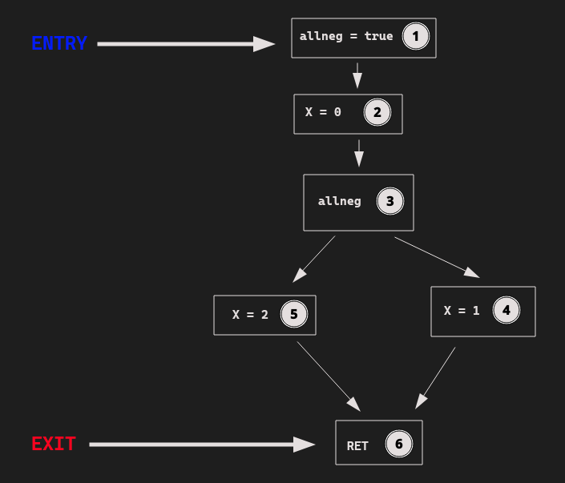

# simple.imp

```java
class Example {
  main() {
    def allneg = true;
    def X = 0;
    if (allneg) {
      X = 1;
    } else {
      X = 2;
    }
  }
}
```

# CFG



# Dominance Analysis

| ProgramPoint | $State_{0}$        | $State_{1}$  |
| ------------ | ------------------ | -------------|
|  1           | {1}                | {1}          |
|  2           | {1, 2, 3, 4, 5, 6} | {1, 2}       |
|  3           | {1, 2, 3, 4, 5, 6} | {1, 2, 3}    |
|  4           | {1, 2, 3, 4, 5, 6} | {1, 2, 3, 4} |
|  5           | {1, 2, 3, 4, 5, 6} | {1, 2, 3, 5} |
|  6           | {1, 2, 3, 4, 5, 6} | {1, 2, 3, 6} |
